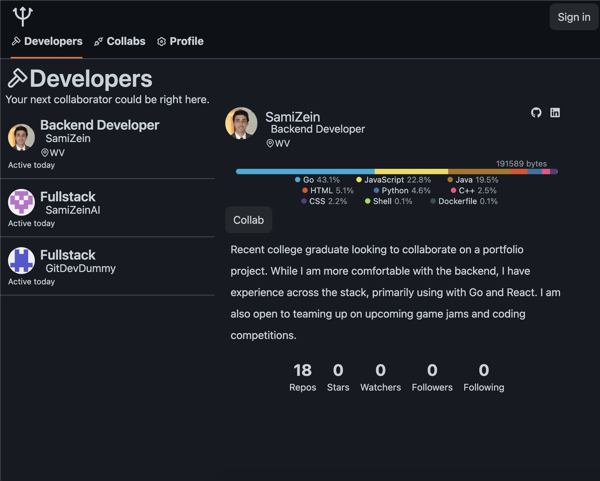

# Gitdev

Gitdev is a developer collaboration website. It takes a developer-first approach for times when githubs' project-first approach may not be suitable. By requiring a github sign-in, Gitdev is able to streamline account creation and secure authentication while also leveraging their API to provide a comprehensive representation of a potential collaborators information, offering insight otherwise not readily available. Try it out yourself and see you own user language breakdown!



# Why

- Why is a project-first approach the only popular option for developer collaboration
- Why don't GitHub integrate user info and build better visual representations of a developers proficiencies
- Why do developers that want to team up in game jams and coding competitions not have a reasonable option

## Features

- Sign in with GitHub
- Automatic profile population based on GitHub data
- Developers page shows new potential collaborators in a job board format
  - Linguistics bar shows a users language distribution at an account level as oppose to the repository level that GitHub offers
- Collabs page shows the user all their collabs, including contact info otherwise inaccessible
- Profile page shows the user their own info and allows them to update it

## Technologies Used

- React
- Tailwind CSS
- Go
  - sqlc
  - goose
- PostgreSQL

## Getting Started

### Prerequisites

- Go
- PostgreSQL

### Contributing

1. Clone the repository

```bash
git clone https://github.com/SamiZein/gitdev
cd gitdev
```

2. Install dependendencies

```bash
cd react && npm install && npm run dev && cd ..
```

3. Build go server

```bash
cd server && go build -o out && ./out && cd ..
```

4. Setup PostgreSQL database and then use goose to migrate it to the current version (replace sami with your info)

```bash
cd server/sql/schema && goose postgres postgres://sami:@localhost:5432/gitdev up
```

5. Update codebase and submit a pull request
